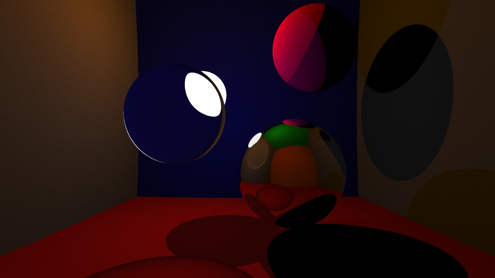

## Raytracing with OpenCL
A quick ray tracey using GPU acceleration as a first use of OpenCL. The part of the code regarding OpenCL inititalization was made following tutorials at http://raytracey.blogspot.com/.


For now, the ray tracer displays only spheres, using effects such as lighting, reflexion, refraction, Anti-aliasing and BRDF.

## Dependencies
OpenCL is obviously needed. Library file used in the code is
```</usr/include/CL/cl.hpp>```

## Build & Usage
Simple build using cmake, and then just launch the executable.
```
cmake .
make
./RayTracing
```
The image produced is ```image_raytracing.png```.



